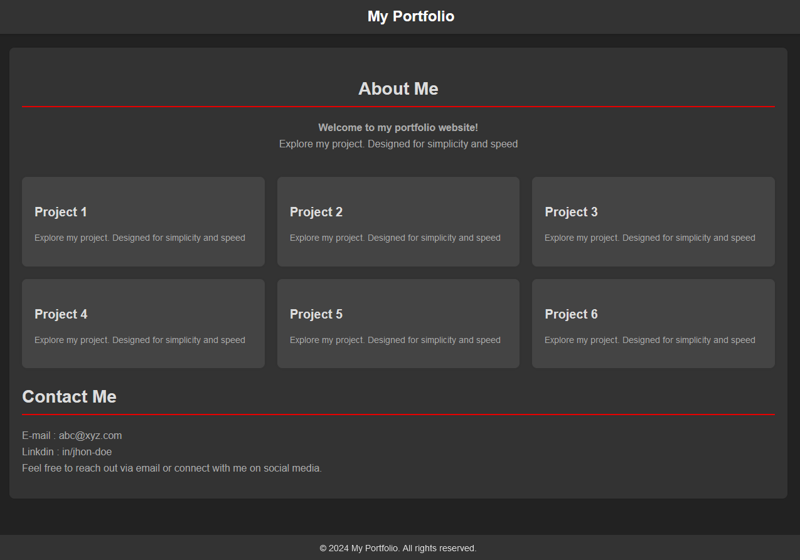

# Portfolio Template

This repository contains a clean and modern portfolio website template built with HTML, CSS, and JavaScript. It features designed to showcase your projects and personal information effectively.Below is an overview and instructions on how to use and customize the template.

## Overview

This template includes sections for:
- **About Me**: Introduce yourself and your portfolio.
- **Portfolio**: Display your projects with brief descriptions and links.
- **Contact Me**: Provide contact information.

## Preview



## How to Use

1. **Clone the repository:**
   ```bash
   git clone https://github.com/vanu888/portfolio-template.git
   ```
   
2. **Navigate into the directory:**
   ```bash
   cd portfolio-template
   ```

3. **Open `index.html` in your web browser** to view the template locally.

## Customization

- Update `index.html` with your own content for each section.
- Modify `styles.css` to adjust colors, fonts, and layout as needed.
- Add more projects to the portfolio section by duplicating the `.item` structure.

## Features

- Responsive layout for various screen sizes.
- Popup modal for displaying project details.
- Basic JavaScript for popup functionality.
- Structured sections for easy navigation.

## Deployment

To deploy your portfolio online:
- Upload the contents of the repository to your web server.
- Consider using GitHub Pages for hosting.

## License

This template is licensed under the MIT License. See the [LICENSE](LICENSE) file for more details.

## Support

For any questions or suggestions, feel free to [open an issue](https://github.com/vanu888/portfolio-template/issues) on GitHub.


